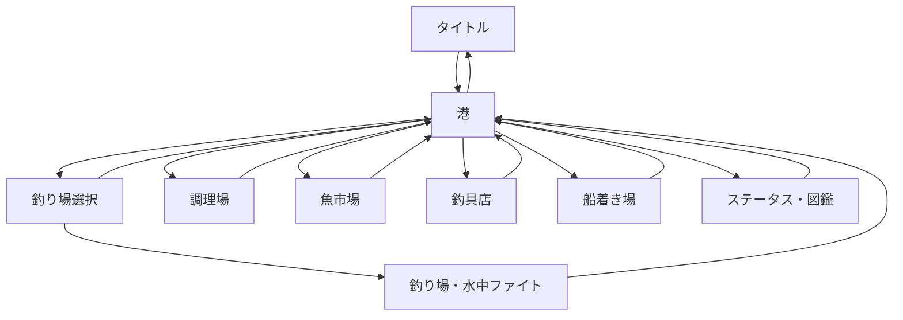

# 画面遷移とUI仕様

## 1. 画面遷移



## 2. 基準解像度

- 1280×720
- 16:9
- 画面端マージン：12～18px
- 通常文字：18px
- 見出し：26～32px
- タイトル：48px以上
- ボタン高さ：50px以上

## 3. 釣り場選択画面

港の「釣り場へ向かう」から遷移する。

初期実装は本格的な地図ではなく、釣り場カードを並べる選択画面とする。

### カード表示内容

- 釣り場名
- 解放レベル
- 水深目安
- よく釣れる魚
- レア魚の気配
- おすすめエサ
- 未解放時のロック表示

### UIルール

- 解放済みポイントは1クリックで選べる。
- 未解放ポイントは選択不可にし、必要Lvを明示する。
- レベル到達済みでも船不足で出航できないポイントは選択不可にし、必要な船を明示する。
- 高レベルポイントでも低レベル魚が混ざることを、説明文で過度に隠さない。
- 地図アートを追加する場合も、カードの情報密度と選択しやすさを優先する。

## 4. 水中ファイト画面

### 優先順位

1. 魚の姿と行動
2. テンションゲージ
3. 魚体力
4. 巻く／糸を出す操作
5. 距離、水深、プレイヤー体力
6. 魚情報

### UIルール

- 画面中央の魚をUIで隠さない。
- 突進時はテキストだけでなく、魚の位置・向きも変化させる。
- 安全域と危険域は将来ゲージ色で分ける。
- アワセ可能中は中央へ強い視覚・音響フィードバックを出す。
- ボタン長押しが必要なことをラベルで示す。

### 魚種公開タイミング

- 魚の内部抽選は釣行開始時に行うが、`READY`、`CASTING`、`WAITING`、`APPROACH`、`BITE` では魚名、魚画像、No.、レアリティ、推定サイズ、魚固有の好むエサを表示しない。
- ヒット前の右カードは「未確認の魚影」として扱い、未確認の魚影、選択中の釣り場、反応の強さ、狙い、タナ、使用中のエサだけを表示する。
- ヒット前の行動カードは「今の状況」として扱い、魚種固有の行動名ではなく釣りの進行状態と次の操作だけを表示する。
- `BITE` 中は「何かが食いついた」状態までに留め、アワセるまで正体を伏せる。
- `FIGHT` 開始時に初めて魚種を公開し、右カードと水中ファイト画面へ魚名、魚画像、No.、レアリティ、推定サイズを表示する。
- `BITE` でアワセに失敗して逃走した場合、魚種は最後まで未確認のままとする。
- `FIGHT` 後に逃走した場合は、水中で確認済みの魚として扱う。

### 港へ戻る導線

- 下部HUD右端には「港へ戻る」を明示し、クリック範囲は同ボタンに限定する。
- `READY` では「港へ戻る」を押すと即座に港へ戻る。
- `CASTING`、`WAITING`、`APPROACH`、`BITE` では「釣りを中断して港へ戻りますか？」の確認を出す。
- `FIGHT` では「ファイトを中断すると魚は逃げます。港へ戻りますか？」の確認を出す。
- 確認表示中は釣りの進行を止め、キャンセルすると同じ状態から再開する。
- `Esc` と `-` キーでも同じ帰港導線を開く。確認表示中は `Enter` で帰港、`Esc` でキャンセルする。

## 5. 船着き場画面

港の「船着き場」から遷移する。釣具店とは分離し、船の購入と出航可能範囲の確認だけを扱う。

### 表示内容

- 上部ステータス：レベル、所持金、現在の最大船ランク
- 左：船3種のカード一覧、状態バッジ、価格バッジ、船名、到達範囲
- 中央：選択中の船、購入状態、価格、不足額、航行ランク、購入ボタン
- 右：購入前/購入後に広がる航路/到達範囲
- 下部：戻るボタンと購入結果/資金不足メッセージ

### UIルール

- 船は装備切り替えを持たない恒久アンロックとして表示する。
- 所持済みの船は再購入できない。
- 所持金不足の船は購入ボタンを無効化し、不足金額が分かるメッセージを出す。
- 背景画像側の空欄フレームはそのまま残さず、Godot側の状態/価格/到達範囲UIで埋める。
- 釣り場選択の船不足表示と同じ船マスターを参照する。

## 6. 調理画面

3カラム構成とする。

```text
所持魚一覧 | 料理一覧 | 料理詳細・調理ボタン
```

料理詳細には次を必ず表示する。

- 完成料理名
- 使用魚と消費前後の所持数
- 獲得食経験値
- 初回ボーナスの有無
- 次の釣行で得る効果
- 効果が既存バフを上書きすること

## 7. レベルアップ演出

正式版では共通ポップアップとして実装する。

- 旧レベル → 新レベル
- 上昇した能力値
- 新しい解放要素
- 新しい釣り場ポイント
- Lv.5では「港のぬし解放」を強調

MVPコードでは調理結果欄に同情報を表示する。

## 8. コンセプト画像

`reference/` 内に次の企画画像を格納する。

- 水上の釣りUI
- 水中ファイトUI
- 調理・食事・レベルアップUI

画像はレイアウトと雰囲気の基準であり、そのまま1枚絵として実装しない。背景、魚、ゲージ、ボタン、文字、アイコンへ分解して制作する。
